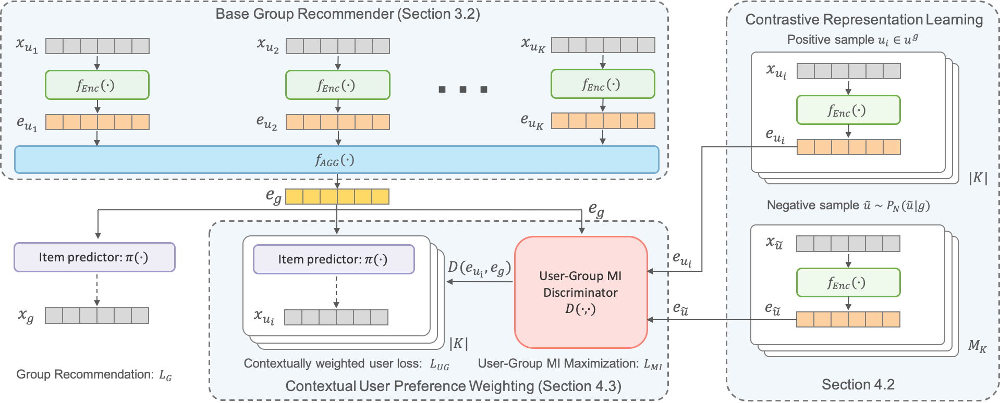

## GroupIM: A Mutual Information Maximization Framework for Neural Group Recommendation

##### Contributors: [Aravind Sankar](http://asankar3.web.engr.illinois.edu/) (asankar3@illinois.edu).

> Aravind Sankar, Yanhong Wu, Yuhang Wu, Wei Zhang, Hao Yang and Hari Sundaram, "GroupIM: A Mutual Information 
Maximization Framework for Neural Group Recommendation", International ACM SIGIR conference on
               research and development in Information Retrieval, 
<b>SIGIR
 2020</b>, Virtual Event, China, July 25-30, 2020.

This repository contains a PyTorch implementation of Group Information Maximization (GroupIM) -  a neural framework for recommending items to groups of users. 
GroupIM has three modules: user preference encoder, group preference 
aggregator, and a training objective over user and group interactions with mutual information maximization. GroupIM 
supports arbitrary preference encoder and aggregator architectures for group recommendation. 



### Requirements
The code has been tested running under Python 3.6 with the following packages installed (along with their dependencies):


```
numpy==1.18.1
pandas==1.0.3
scikit-learn==0.23.1
scipy==1.4.1
torch==1.1.0
```
To guarantee that you have the right package versions, you can use Anaconda to set up a virtual environment and install the above packages.

### Input Format

This repository includes one dataset ``Weeplaces`` for POI recommendation to groups of users.
The set of all groups are randomly partitioned into training (70%), validation
(10%), and test (20%) sets, while individual user-item interactions of all users are used for training 
The validation and test sets contain strict ephemeral groups (<i>i.e.</i>, a
specific combination of users) that do not occur in the training set.


In order to use your own data, you have to provide the following files:

- ``train_ui.csv``: a csv file specifying the training set of user-item interactions (one 
pair per line) where each line contains a ``(u, i)`` pair.

- ``val_ui_tr.csv, test_ui_tr.csv``: csv files specifying fold-in item interactions for the validation and test sets 
of users. 


- ``val_ui_te.csv, test_ui_te.csv``: csv files specifying held-out item interactions for the validation and test sets 
of users. This set may be used to evaluate user-level item recommendation performance.


- ``train_gi.csv, val_gi.csv, test_gi.csv``: csv files specifying group-item interactions (one 
pair per line) where each line contains a `(g, i)` pair.

- ``group_users.csv``: a csv file specifying group memberships of all users and groups in the dataset where each line contains a ``(g, u)`` pair indicating that user `u` belongs to group `g`. 

### Repository Organization
- ``data/`` contains the necessary input file(s) for each dataset in the specified format.
- ``models/`` contains:
    - GroupIM model (``models.py``);
    - user preference encoder (``encoder.py``)
    - group preference aggregator (``aggregators.py``)
    - discriminator for mutual information estimation and maximization (``discriminator.py``)
    
    
    
- ``utils/`` contains:
    - mini-batch loaders for user-item interactions (``user_utils.py``);
    - mini-batch loaders for group-item interactions (``group_utils.py``);
- ``eval/`` contains:
    - ranking metrics NDCG and Recall at K (``metrics.py``);
    - helper functions to evaluate recommendation performance (``evaluate.py``);

### Running the Model
To train and evaluate the model (<i>e.g.,</i> on `weeplaces`), please run
```bash
python train.py --dataset weeplaces --cuda --pretrain_user --pretrain_mi
```

Note: The model is not deterministic. All the experimental results provided in the paper are averaged across multiple
 runs.
 
 
## Reference
 If you make use of this code or the GroupIM algorithm in your work, please cite the following paper:

```
@inproceedings{sankar2020groupim,
  title     = {GroupIM: A Mutual Information Maximization Framework for Neural Group Recommendation},
  author    = {Sankar, Aravind and Wu, Yanhong and Wu, Yuhang and Zhang, Wei and Yang, Hao and Sundaram, Hari},
  doi       = {10.1145/3397271.3401116},
  booktitle = {Proceedings of the 43rd International ACM SIGIR Conference on Research and Development in Information Retrieval},  
  pages     = {1279--1288},
  year = {2020}
}
```